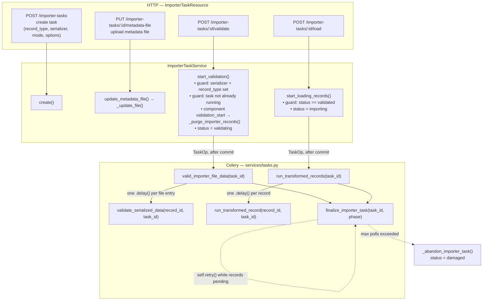
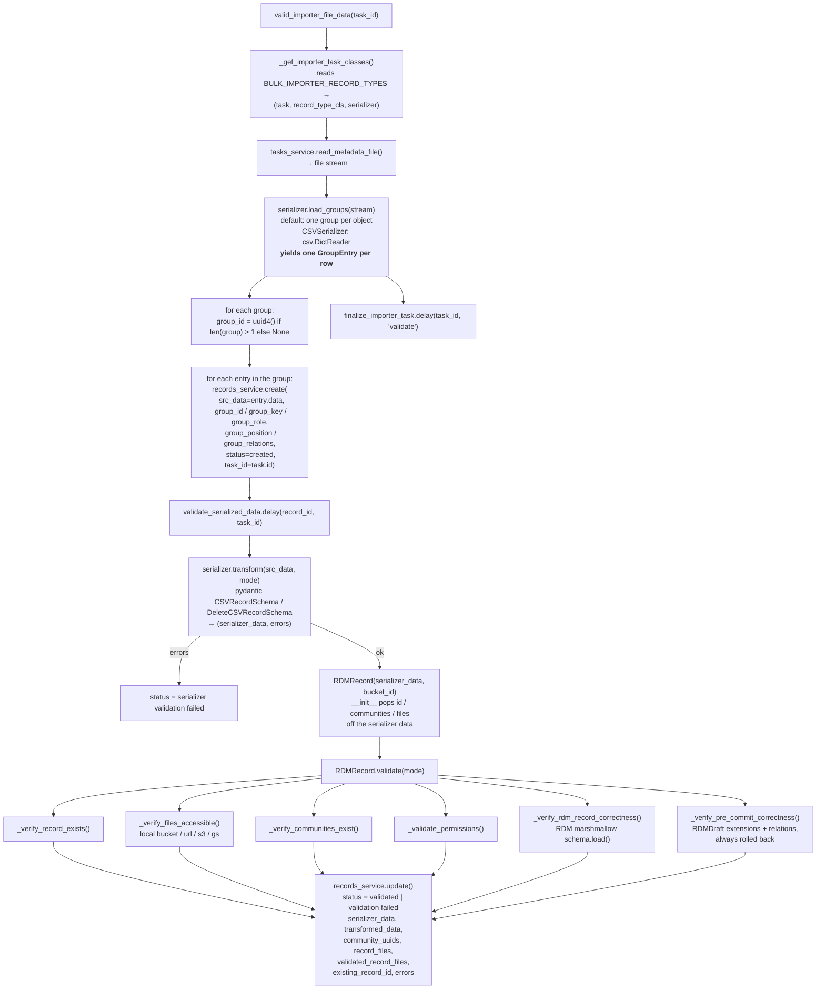
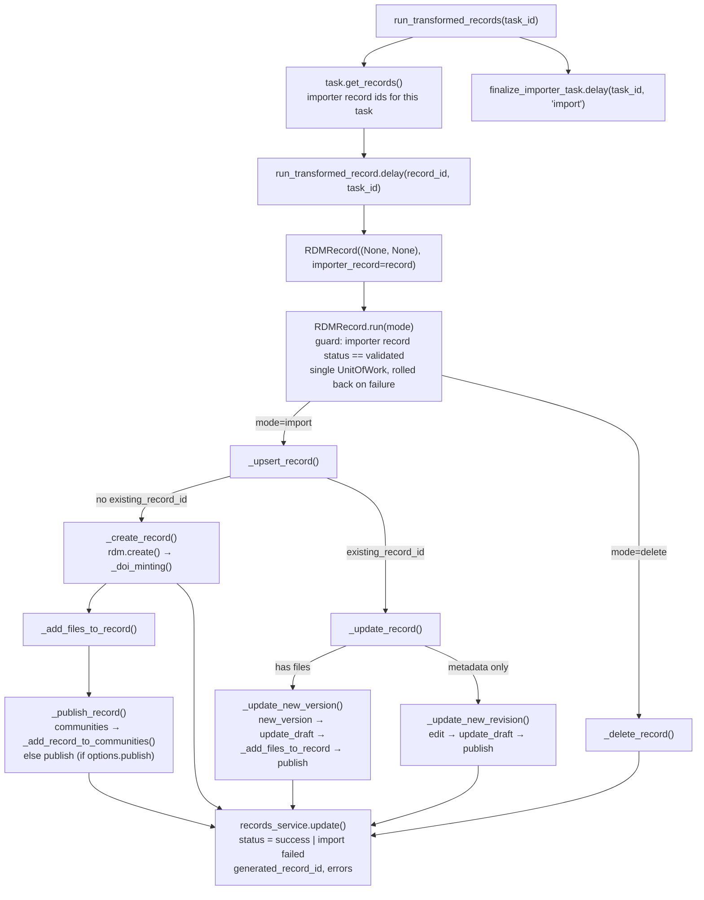
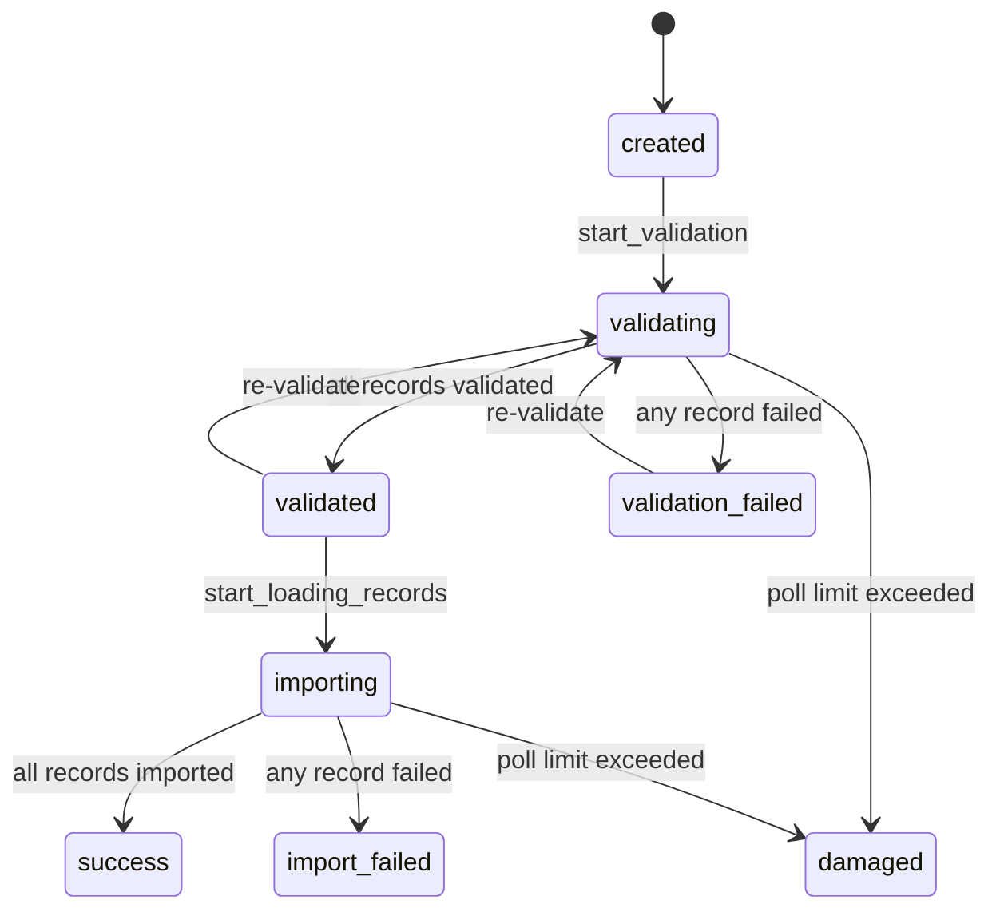

# Importer flow

How an importer task goes from an uploaded metadata file to published Invenio
records. Everything below is the current CSV path, where **one row of the
metadata file becomes exactly one importer record**.

Two phases, each user-triggered and each run asynchronously by Celery:

* **validate** — parse the file, create one `ImporterRecord` per entry, and
  check that each entry could become a repository record.
* **import** — turn every validated importer record into a real RDM record.

## End-to-end lifecycle

## Validation phase

`valid_importer_file_data` is the **fan-out point**: it is the only place that
decides how many importer records a metadata file produces.

It reads the file a *group* at a time. A group is the set of records that have to
be imported together so identifiers can be resolved between them — a book and its
chapters, say. `Serializer.load_groups()` defaults to one group per object, so a
format describing one record per entry (CSV) yields groups of one and behaves
exactly as it always has. A group of one carries no `group_id`; where the records
of a task are grouped for import, `ImporterTask.get_record_groups()` falls back to
the record's own id, so each stays a group of its own.

## Import phase

A single record can also be re-run on its own via
`POST /importer-records/:id/run` → `ImporterRecordService.start_run()` →
`run_transformed_record.delay()`, skipping the task-level fan-out.

## Status bookkeeping

`finalize_importer_task` is the only thing that moves the *task* status. It
re-reads the per-state record counts and recomputes the task state on every
pass, rescheduling itself while any record is still in a pending state for the
current phase.

Pending states per phase come from `PENDING_RECORD_STATES`: `created` during
validate, `validated` during import. Task state itself is derived from the
record counts by `TaskStateCalculator.calculate_task_state()`.
